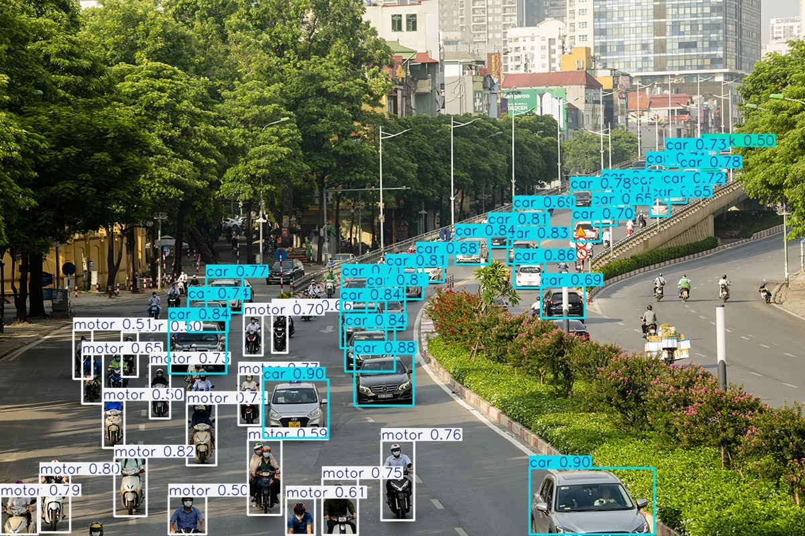

# 🚗 YOLOv8 Vehicle Counting & Tracking System


## 📖 Introduction

This project is a computer vision application developed to detect, track, and count vehicles in a specified Region of Interest (ROI). It combines a fine-tuned **YOLOv8** model for detection and **ByteTrack** algorithm for robust object tracking.

The system is designed to handle real-world traffic scenarios, filtering vehicles by class (Bus, Car, Motor, Truck) and counting them only when they pass through a predefined Polygon Zone.

## 📸 Demo & Visualization

### 1. Object Detection (Snapshot)
Here is an example of the model detecting vehicles with bounding boxes and class labels.


### 2. Tracking & Counting (Video Demos)
The system tracks IDs and updates the counter when vehicles enter the polygon zone. It is tested to work robustly in different lighting conditions (day & night).


<p align="center">
  <em>Demonstration of vehicle counting during daytime.</em>
</p>

<br> 
<p align="center">
  <em>Demonstration of vehicle counting during nighttime/low-light conditions.</em>
</p>


## ✨ Key Features

* **Custom Object Detection:** Fine-tuned YOLOv8 model specifically for 4 classes: `bus`, `car`, `motor`, `truck`.
* **Robust Tracking:** Implements **ByteTrack** (via `my_tracker.yaml`) to maintain consistent Object IDs across frames, handling occlusion better than standard methods.
* **Polygon Zone Counting:** Uses `cv2.pointPolygonTest` to strictly count vehicles only inside the defined ROI, avoiding false counts at the edges.
* **Data Pipeline:** Includes scripts for merging datasets (`merge_dataset.py`) and standardizing labels (`modify_class.py`) before training.
* **Automated Reporting:** Outputs a processed video `.mp4` and a text summary `report.txt` containing final counts and execution time.

## 🛠️ Project Structure

```text
YOLOv8-Vehicle-Counting/
│
├── assets/                  # Demo media (images/videos) and tracker config
│   ├── my_tracker.yaml      # ByteTrack configuration file
│   └── traffic4.pt          # Trained YOLOv8 model weights
├── configs/                 # Dataset config (data.yaml)
├── src/                     # Source code
│   ├── data_preprocessing/  # Scripts for dataset preparation
│   ├── train.py             # Training script
│   └── utils.py             # Helper functions (frame extraction, etc.)
├── main.py                  # Main inference & counting script
├── requirements.txt         # Dependencies (ultralytics, opencv, etc.)
└── README.md                # Project documentation
```

## ⚙️ How It Works (Logic from Notebook)

1. Input: Reads video frame by frame.
2. Detection: YOLOv8 predicts bounding boxes for vehicles.
3. Tracking: ByteTrack assigns unique IDs to detected objects.
4. Counting Logic:
- A Polygon ROI (Region of Interest) is drawn on the frame.
- The system checks if the center point (anchor) of a vehicle's box is inside the Polygon.
- If inside + New ID $\rightarrow$ Increment Counter (vehicle_counts).
5. Output: Draws bounding boxes, IDs, ROI, and Real-time FPS on the video.

## 🚀 Installation & Usage

### 1. Setup Environment
```bash
git clone [https://github.com/NguyenAn080105/yolov8-vehicle-counting.git](https://github.com/NguyenAn080105/Yyolov8-vehicle-counting.git)
cd YOLOv8-Vehicle-Counting
pip install -r requirements.txt
```

### 2. Run Inference (Counting)
Execute the main script. Make sure your video and model paths are correct in main.py.
```bash
python main.py
```
Note: The script currently defaults to source=assets/vehicle_vid_13.mp4 and uses assets/my_tracker.yaml.

## 👤 Author <br>
Name: Hoang An Nguyen <br>
GitHub: NguyenAn080105 <br>
Email: nguyenan080105@gmail.com